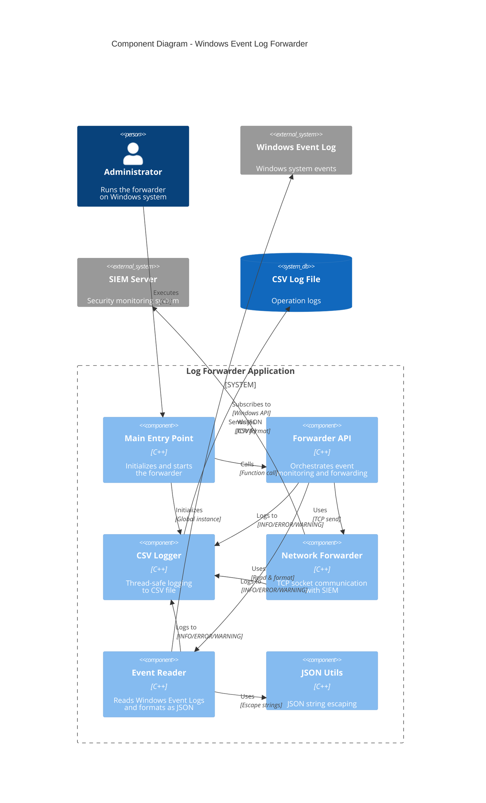
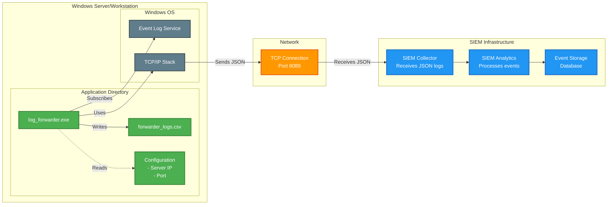

# Windows Event Log Forwarder - Architecture Diagram

## System Architecture

```mermaid
graph TB
    subgraph "Windows Event Log Forwarder Application"
        subgraph "Entry Point Layer"
            MAIN[Main<br/>main.cpp]
        end

        subgraph "API Layer"
            API[Forwarder API<br/>forwarder_api.cpp<br/>- runForwarder&#40;&#41;<br/>- forwardWindowsLogs&#40;&#41;]
        end

        subgraph "Core Services"
            LOGGER[Logger Service<br/>logger.cpp<br/>- CSV logging<br/>- Thread-safe<br/>- Auto-flush]
            FORWARDER[Log Forwarder<br/>log_forwarder.cpp<br/>- TCP/IP socket<br/>- Connection mgmt<br/>- Send logs]
        end

        subgraph "Utility Layer"
            EVENTREADER[Event Log Reader<br/>event_log_reader.cpp<br/>- Read events<br/>- Extract properties<br/>- Format as JSON]
            JSONUTILS[JSON Utils<br/>json_utils.cpp<br/>- Escape strings<br/>- JSON formatting]
        end

        subgraph "Data Storage"
            CSVLOG[(forwarder_logs.csv<br/>Timestamp, Level,<br/>Component, Message,<br/>Details)]
        end
    end

    subgraph "Windows Operating System"
        WINLOG[Windows Event Log<br/>- System<br/>- Application<br/>- Security]
        WINSOCK[Winsock2 API<br/>- TCP/IP stack<br/>- Network I/O]
    end

    subgraph "External Systems"
        SIEM[SIEM Server<br/>- Receives JSON logs<br/>- TCP port 8089]
    end

    %% Data Flow
    MAIN -->|Initialize| LOGGER
    MAIN -->|Execute| API
    API -->|Create & use| FORWARDER
    API -->|Subscribe| WINLOG
    API -->|Read events| EVENTREADER
    EVENTREADER -->|Format| JSONUTILS
    EVENTREADER -->|Query| WINLOG
    FORWARDER -->|Connect| WINSOCK
    WINSOCK -->|TCP/IP| SIEM
    FORWARDER -->|Send JSON| SIEM
    LOGGER -->|Write| CSVLOG
    API -.->|Log operations| LOGGER
    FORWARDER -.->|Log operations| LOGGER
    EVENTREADER -.->|Log operations| LOGGER
    MAIN -.->|Log operations| LOGGER

    %% Styling
    classDef coreService fill:#4CAF50,stroke:#2E7D32,stroke-width:2px,color:#fff
    classDef utility fill:#2196F3,stroke:#1565C0,stroke-width:2px,color:#fff
    classDef external fill:#FF9800,stroke:#E65100,stroke-width:2px,color:#fff
    classDef storage fill:#9C27B0,stroke:#6A1B9A,stroke-width:2px,color:#fff
    classDef os fill:#607D8B,stroke:#37474F,stroke-width:2px,color:#fff

    class LOGGER,FORWARDER coreService
    class EVENTREADER,JSONUTILS utility
    class SIEM external
    class CSVLOG storage
    class WINLOG,WINSOCK os
```



## Component Architecture



## Deployment View



## Layer Breakdown

### 1. Entry Point Layer
**Component**: `main.cpp`
- Parses command-line arguments (server address, port)
- Initializes global logger
- Delegates execution to Forwarder API
- Handles graceful shutdown

### 2. API Layer
**Component**: `forwarder_api.cpp`
- Orchestrates the entire forwarding workflow
- Manages LogForwarder lifecycle
- Subscribes to Windows Event Log channels
- Implements reconnection logic
- Coordinates event reading, formatting, and forwarding

### 3. Core Services Layer

#### Logger Service (`logger.cpp`)
- **Purpose**: Centralized logging for all components
- **Features**:
  - Thread-safe operation
  - CSV format output
  - Multiple log levels (INFO, WARNING, ERROR, DEBUG)
  - Auto-flush for real-time visibility
- **Output**: `forwarder_logs.csv`

#### Network Forwarder (`log_forwarder.cpp`)
- **Purpose**: TCP socket communication
- **Features**:
  - Winsock2 integration
  - Connection management
  - Automatic reconnection
  - JSON transmission
- **Protocol**: TCP/IP to SIEM server

### 4. Utility Layer

#### Event Log Reader (`event_log_reader.cpp`)
- **Purpose**: Interface to Windows Event Log API
- **Functions**:
  - Subscribe to event channels
  - Extract event properties
  - Format events as JSON

#### JSON Utils (`json_utils.cpp`)
- **Purpose**: JSON string handling
- **Functions**:
  - Escape special characters
  - Ensure JSON compliance

## Data Flow Summary

```
Windows Event Log
    ↓ (Windows API)
Event Log Reader
    ↓ (Extract & Format)
JSON Utils
    ↓ (Escaped JSON)
Forwarder API
    ↓ (Orchestrate)
Network Forwarder
    ↓ (TCP Socket)
SIEM Server

    +
    ↓ (All layers log to)
CSV Logger
    ↓ (Write)
forwarder_logs.csv
```

## Technology Stack

| Layer | Technology |
|-------|------------|
| **Language** | C++17 |
| **Compiler** | MinGW-w64 g++ |
| **Windows APIs** | Windows Event Log API (`winevt.h`)<br/>Winsock2 (`ws2_32.lib`) |
| **Libraries** | Standard C++ Library<br/>Windows SDK |
| **Build System** | Direct g++ compilation (build.bat) |
| **Output Format** | JSON (for events)<br/>CSV (for logs) |

## Design Principles

1. **Separation of Concerns**: Each component has a single, well-defined responsibility
2. **Modularity**: Components are loosely coupled and highly cohesive
3. **Observability**: Comprehensive logging of all operations
4. **Resilience**: Automatic reconnection and error recovery
5. **Simplicity**: Direct compilation without complex build dependencies
6. **Thread Safety**: Logger uses mutex for concurrent access
7. **Resource Management**: RAII pattern for cleanup (destructors)

## File Structure

```
siem/forwarder/windows/
├── inc/                          # Header files
│   ├── event_log_reader.h
│   ├── forwarder_api.h
│   ├── json_utils.h
│   ├── log_forwarder.h
│   └── logger.h
├── src/                          # Source files
│   ├── event_log_reader.cpp
│   ├── forwarder_api.cpp
│   ├── json_utils.cpp
│   ├── log_forwarder.cpp
│   ├── logger.cpp
│   └── main.cpp
├── bin/                          # Build output
│   └── log_forwarder.exe
├── docs/                         # Documentation
│   ├── class_diagram.md
│   ├── sequence_diagram.md
│   └── architecture_diagram.md
├── build.bat                     # Build script
└── forwarder_logs.csv           # Runtime logs
```
