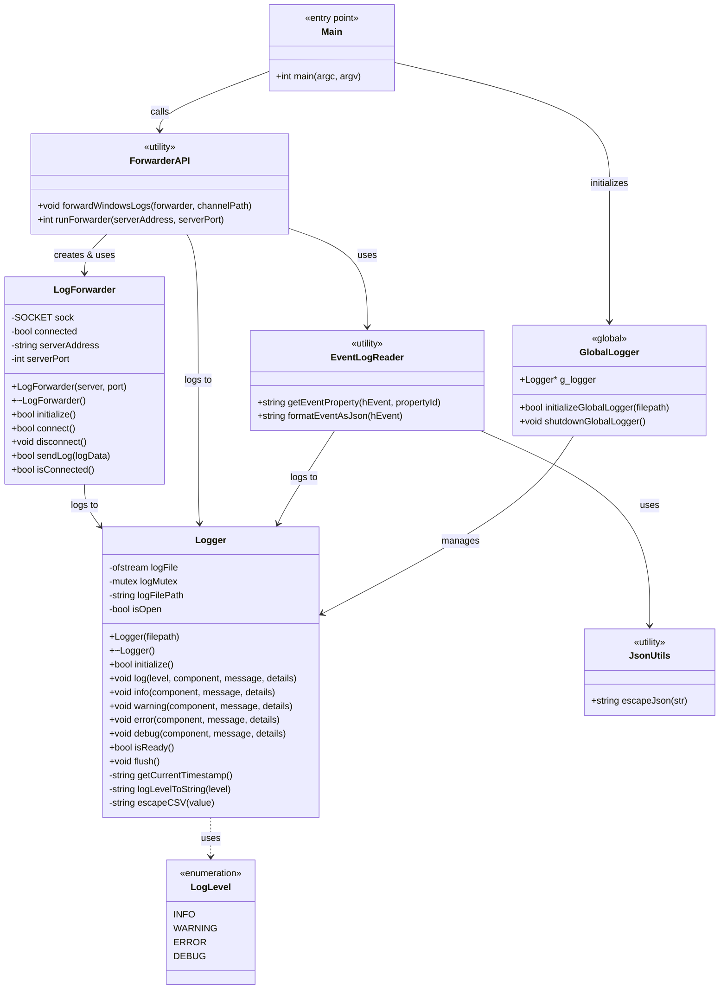

# Windows Event Log Forwarder - Class Diagram

## UML Class Diagram



## Component Descriptions

### Core Classes

#### Logger
- **Purpose**: Thread-safe CSV logging system
- **File**: `logger.h`, `logger.cpp`
- **Key Features**:
  - CSV format output (Timestamp, Level, Component, Message, Details)
  - Thread-safe with mutex protection
  - Auto-flush for real-time logging
  - Multiple log levels (INFO, WARNING, ERROR, DEBUG)

#### LogForwarder
- **Purpose**: TCP socket communication with SIEM server
- **File**: `log_forwarder.h`, `log_forwarder.cpp`
- **Key Features**:
  - Windows Sockets API (Winsock2) integration
  - Connection management with retry logic
  - JSON log transmission
  - Connection state tracking

### Utility Modules

#### EventLogReader
- **Purpose**: Windows Event Log reading and monitoring
- **File**: `event_log_reader.h`, `event_log_reader.cpp`
- **Functions**:
  - `getEventProperty()`: Extract event properties
  - `formatEventAsJson()`: Convert events to JSON

#### JsonUtils
- **Purpose**: JSON string formatting utilities
- **File**: `json_utils.h`, `json_utils.cpp`
- **Functions**:
  - `escapeJson()`: Escape special characters for JSON

#### ForwarderAPI
- **Purpose**: High-level API orchestration
- **File**: `forwarder_api.h`, `forwarder_api.cpp`
- **Functions**:
  - `forwardWindowsLogs()`: Monitor and forward events
  - `runForwarder()`: Main entry point for forwarding service

### Entry Point

#### Main
- **Purpose**: Application initialization and configuration
- **File**: `main.cpp`
- **Responsibilities**:
  - Parse command-line arguments
  - Initialize global logger
  - Invoke ForwarderAPI
  - Handle cleanup on exit

## Data Flow

```
Main
  ↓
Initialize GlobalLogger
  ↓
Call runForwarder()
  ↓
Create LogForwarder instance
  ↓
Connect to SIEM server
  ↓
Subscribe to Event Log channel
  ↓
Monitor events loop:
  - Read event
  - Format as JSON (EventLogReader + JsonUtils)
  - Send to SIEM (LogForwarder)
  - Log operation (Logger)
```

## Relationships Summary

1. **Main → GlobalLogger**: Initializes the global logger instance at startup
2. **Main → ForwarderAPI**: Calls `runForwarder()` to start the service
3. **ForwarderAPI → LogForwarder**: Creates and uses LogForwarder for network communication
4. **ForwarderAPI → EventLogReader**: Uses to read and format Windows events
5. **EventLogReader → JsonUtils**: Uses for JSON escaping
6. **All Components → Logger**: All components log their operations to CSV file
7. **Logger → LogLevel**: Uses enumeration for log severity levels

## Design Patterns

- **Singleton Pattern**: Global logger instance (`g_logger`)
- **Utility/Helper Pattern**: EventLogReader, JsonUtils (stateless functions)
- **Facade Pattern**: ForwarderAPI provides simplified interface to complex subsystems
- **Resource Acquisition Is Initialization (RAII)**: Logger and LogForwarder manage resources in constructors/destructors
