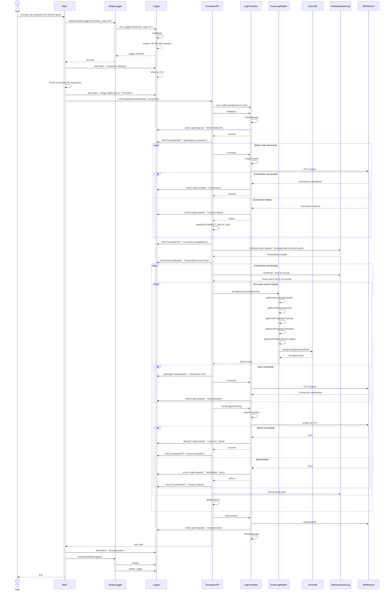
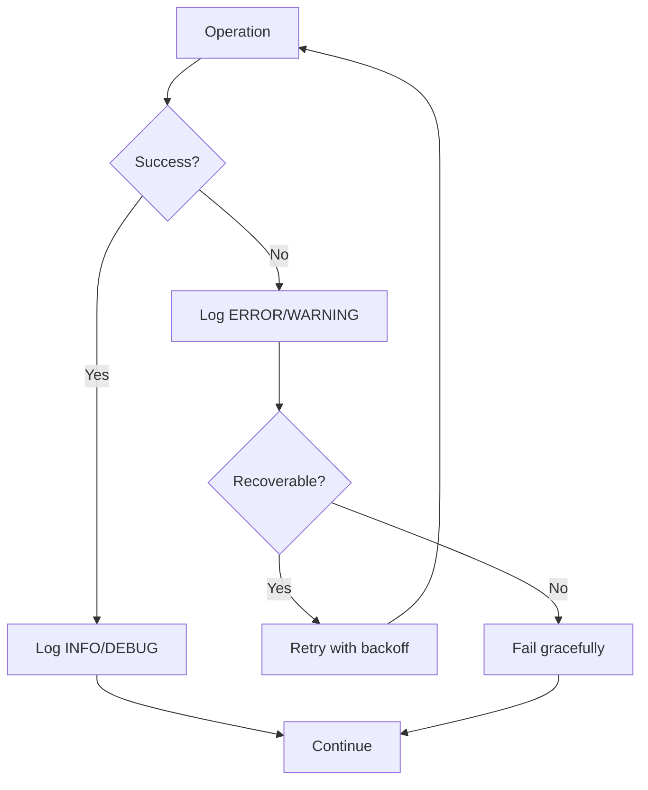

# Windows Event Log Forwarder - Sequence Diagram

## Event Forwarding Flow

## Sequence Description

### 1. Initialization Phase (Lines 1-35)
- User launches the application
- Main initializes the global CSV logger
- Command-line arguments are parsed
- Logger records startup configuration

### 2. Connection Phase (Lines 36-62)
- ForwarderAPI creates LogForwarder instance
- Winsock is initialized (WSAStartup)
- Connection attempt to SIEM server
- Retry loop with exponential backoff if connection fails
- All connection attempts are logged

### 3. Event Monitoring Phase (Lines 63-72)
- Subscribe to Windows Event Log channel ("System")
- Subscription handle obtained
- Ready to receive events

### 4. Main Event Loop (Lines 73-122)
- **Event Retrieval**: Wait for new events (up to 10 per batch)
- **Event Processing**: For each event:
  1. Extract properties (EventID, Level, Channel, Computer, TimeCreated)
  2. Format as JSON with proper escaping
  3. Check connection status
  4. Reconnect if connection was lost
  5. Send JSON to SIEM server via TCP
  6. Log success/failure
  7. Close event handle
- **Throttling**: Small delay between batches

### 5. Shutdown Phase (Lines 123-140)
- Graceful disconnection from SIEM server
- Close socket and cleanup Winsock
- Flush all pending log entries
- Destroy logger instance
- Exit application

## Key Interactions

| Source | Target | Purpose |
|--------|--------|---------|
| All Components | Logger | Log all operations, errors, warnings |
| ForwarderAPI | LogForwarder | Network communication management |
| ForwarderAPI | EventLogReader | Event extraction and JSON formatting |
| EventLogReader | JsonUtils | String escaping for JSON compliance |
| LogForwarder | SIEM Server | TCP transmission of JSON events |
| ForwarderAPI | Windows Event Log | Subscribe and retrieve events |

## Error Handling Flow

## Logging Points

Every significant operation is logged with:
- **Timestamp**: Exact time of operation
- **Level**: INFO, WARNING, ERROR, or DEBUG
- **Component**: Which module logged the event
- **Message**: Description of the operation
- **Details**: Additional context (IP addresses, error codes, byte counts, etc.)

All logs are written to `forwarder_logs.csv` in real-time for monitoring and troubleshooting.
